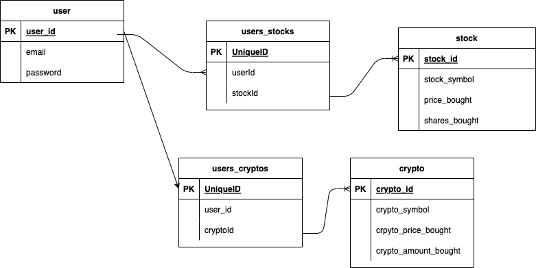

# STOCKTRACKER

Link to my site: https://stocktracker-tylerchan33.koyeb.app/

### Project Description:

Tired of having to track your stocks across multiple accounts?  Not satisfied with your current stock tracking app?  Look no further than Stocktracker!  Stocktracker will let you add your stocks to our page and track them as you become the next Warren Buffett or plunge into despair.  You'll be able to add the price you bought the stock at and see the current stock price using Twelve Data API and see your losses and gains!  

***

### User Stories

- as a User, I want to be able to see how much money I've gained or lost for each stock
- as a User, I want a nice, easy to follow UI
- as a User, I would like to see all of my stocks in one place

***

### API:

https://twelvedata.com/

*** 

### Restful Routing:

| Method | Action | Description |
|:------:|:------:|:-----------:|
| POST   | /users | Creates new user|
| GET    | /users/new | Shows form for creating new user|
| GET    | /users/stocks | Shows user's stocks|
| GET    | /users/cryptos | Shows user's crypto|
| GET    | /users/profile | Shows user's profile|
| PUT    | /users/profile/edit | Edits user information|
| DELETE | /users/profile | Deletes user|

| Method | Action | Description |
|:------:|:------:|:-----------:|
| GET    | /stocks/search | Searches for information about stock|
| GET    | /stocks/add | Shows user form to add their stock|
| GET    | /stocks/:id| Shows user one of their stocks|
| GET    | /stocks/:id/update| Shows user form to update one of their stocks|
| POST   | /stocks/add | Adds stock to user's profile|
| PUT    | /stocks/:id/update | Updates user's stock information|
| DELETE | /stocks/:id| Deletes stock from user's list of stocks|

| Method | Action | Description |
|:------:|:------:|:-----------:|
| GET    | /cryptos/search | Searches for information about crypto|
| GET    | /cryptos/add | Shows user form to add their crypto|
| GET    | /cryptos/:id| Shows user one of their cryptos|
| GET    | /cryptos/:id/update| Shows user form to update one of their cryptos|
| POST   | /cryptos/add | Adds crypto to user's profile|
| PUT    | /cryptos/:id/update | Updates user's crypto information|
| DELETE | /cryptos/:id| Deletes crypto from user's list of crypto|

### Wireframe:

Homepage:

User Stocks Page:

Sign Up Page:

Add Stock Page:

### ERD

### MVP/Stretch Goals

#### MVP

- user is able to view, add, delete, and update stocks on profile
- user can login and save their stocks
- user can add what price they bought the stock at and show their net gain/loss
- user can search for a stock

#### Stretch Goals

- add more information for each stock
- make the page look really nice
- add graph/trends

