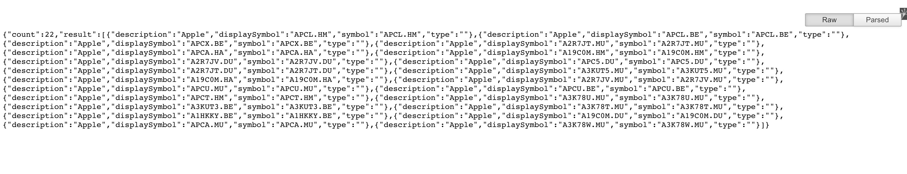
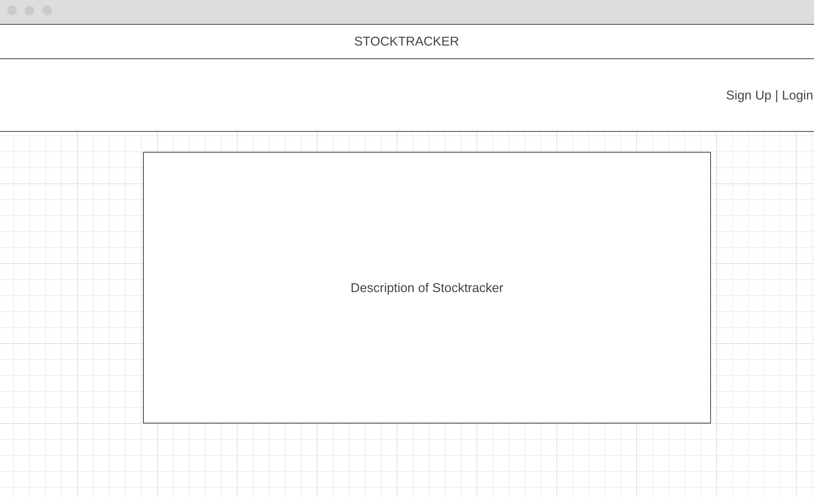
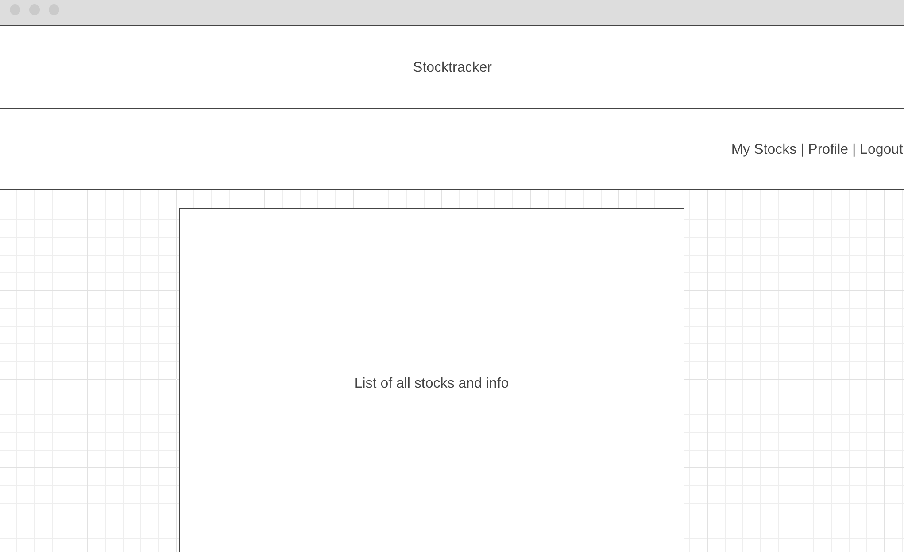
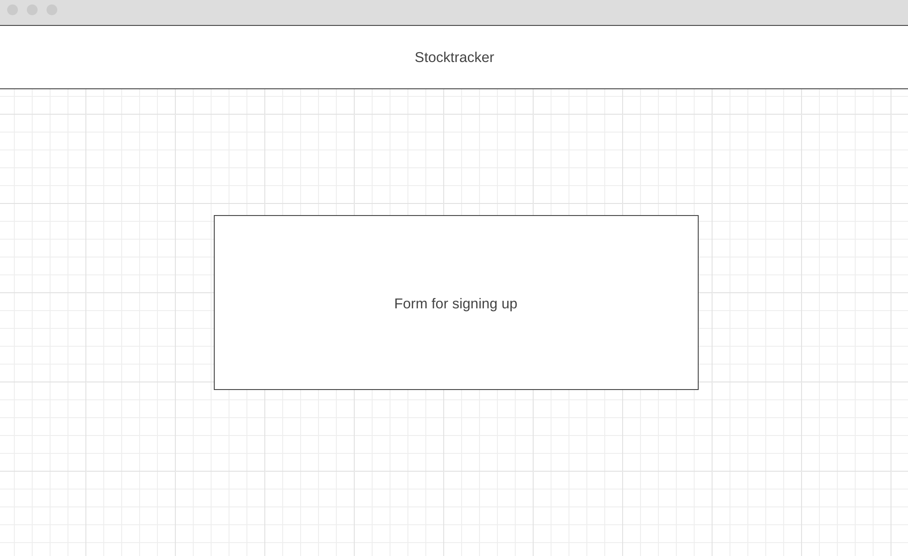
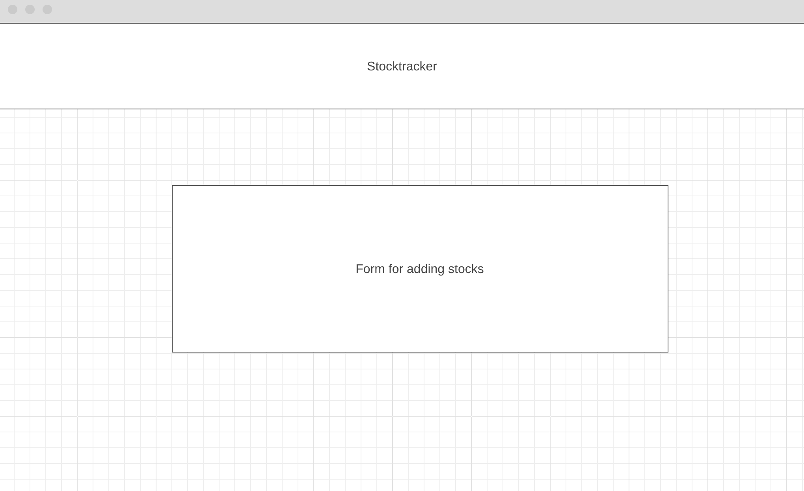
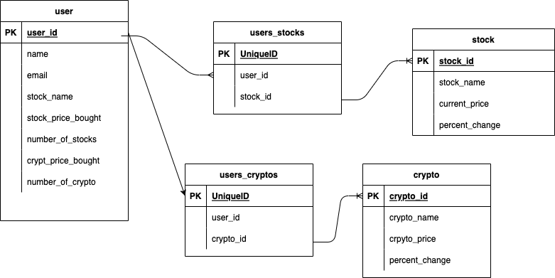

# H1 STOCKTRACKER

### H3 Project Description:

Tired of having to track your stocks across multiple accounts?  Not satisfied with your current stock tracking app?  Look no further than Stocktracker!  Stocktracker will let you add your stocks to our page and track them as you become the next Warren Buffett or plunge into despair.  You'll be able to add the price you bought the stock at and see the current stock price using Finnhub's API and see your losses and gains!  

***

### H3 User Stories

- as a User, I want to be able to see how much money I've gained or lost for each stock
- as a User, I want a nice, easy to follow UI
- as a User, I would like to see all of my stocks in one place

***

### H3 API:

https://finnhub.io/

proof of concept:

*** 

### H3 Restful Routing:

| Method | Action | Description |
|:------:|:------:|:-----------:|
| POST   | /users | Creates new user |
| GET    | /users/new | Shows form for creating new sser |
| PUT    | /users/:id | Edit User |
| DELETE | /users/:id | Delete User |

| Method | Action | Description |
|:------:|:------:|:-----------:|
| GET    | /users/:id/stocks | Show user's stocks |
| POST   | /users/:id/stocks| Add's new stocks to user |
| GET    | /users/:id/stocks/new | Shows form for adding new stocks |
| PUT    | /users/:id/stocks | Updates user's stocks |
| DELETE | /users/:id/stocks/:id | Deletes stock from users list of stocks|

### H3 Wireframe:

Homepage:

User Stocks Page:

Sign Up Page:

Add Stock Page:

### H3 ERD

### H3 MVP/Stretch Goals

#### H4 MVP

- user is able to view, add, delete, and update stocks on profile
- user can login and save their stocks
- user can add what price they bought the stock at and show their net gain/loss
- user can search for a stock

#### H4 Stretch Goals

- add more information for each stock
- make the page look really nice
- add graph/trends
- add cryptocurrency tracker

